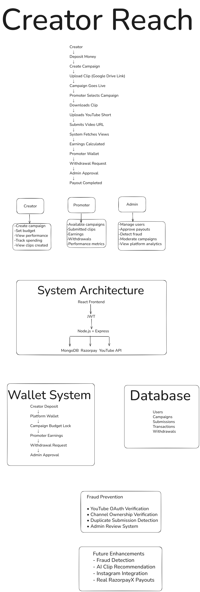

# CeatorReach

CeatorReach is a MERN marketplace for long-form creators and short-form promoters.

Creators deposit test money, create campaigns, and lock campaign budgets. Promoters connect YouTube, submit Shorts for campaigns, earn from tracked views, and request withdrawals. Admin users review platform data, sync or manually update views, and approve simulated withdrawal payouts.

## System Flow



## Tech Stack

- React + Vite + Tailwind CSS
- Node.js + Express
- MongoDB + Mongoose
- JWT authentication
- Razorpay Test Mode for creator wallet deposits
- Google OAuth + YouTube Data API for channel ownership and view sync

## Project Structure

```text
CeatorReach/
  client/   React frontend
  server/   Express backend
```

## Setup

Install all dependencies from the project root:

```bash
npm install
```

Create `server/.env` from `server/.env.example` and fill required values:

```env
PORT=5000
MONGO_URI=replace-with-mongoDB-string
JWT_SECRET=replace-with-a-strong-secret
CLIENT_URL=http://localhost:5173
GOOGLE_CLIENT_ID=your-google-client-id
GOOGLE_CLIENT_SECRET=your-google-client-secret
GOOGLE_REDIRECT_URI=http://localhost:5000/api/youtube/callback
RAZORPAY_KEY_ID=rzp_test_xxxxx
RAZORPAY_KEY_SECRET=xxxxx
```

Run backend and frontend together:

```bash
npm run dev
```

Frontend:

```text
http://localhost:5173
```

Backend:

```text
http://localhost:5000
```

## Main Flows

### Creator

1. Sign up or login as creator.
2. Add wallet money using Razorpay Test Mode.
3. Create campaign with budget and payout rate.
4. Campaign budget is deducted from creator wallet and tracked as campaign remaining budget.

### Promoter

1. Sign up or login as promoter.
2. Connect YouTube account.
3. Pick an active campaign.
4. Submit a YouTube Short URL.
5. Backend verifies the Short belongs to the connected YouTube channel.
6. Views are synced immediately on submission and then by cron every 6 hours.
7. If real views are too slow for demo, admin can manually update submission views.
8. Request withdrawal once withdrawable balance is available.

### Admin

1. Create admin with `server/scripts/create-admin.js`.
2. Login using the normal login form.
3. View users, campaigns, and pending withdrawals.
4. Sync submission views or manually update views.
5. Approve withdrawals with simulated payout references.

## Admin Creation

From `server/`:

```bash
node scripts/create-admin.js "Admin" "admin@example.com" "Admin@12345"
```

Then login from the frontend using the same email and password.

## Payments And Withdrawals

- Creator deposits use Razorpay Test Mode Checkout.
- Withdrawal payouts are simulated only.
- No RazorpayX payout API is called.
- Admin approval generates a fake reference like `TEST_PAYOUT_174889999`.

## Testing

Backend API testing steps are documented in:

```text
server/test.md
```

Withdrawal simulation examples are also available in:

```text
server/withdrawal-simulation.postman.md
```

## Useful Commands

```bash
npm run dev
npm run build
npm run dev --workspace server
npm run dev --workspace client
```
